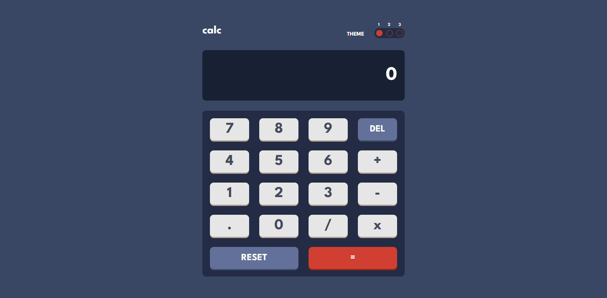
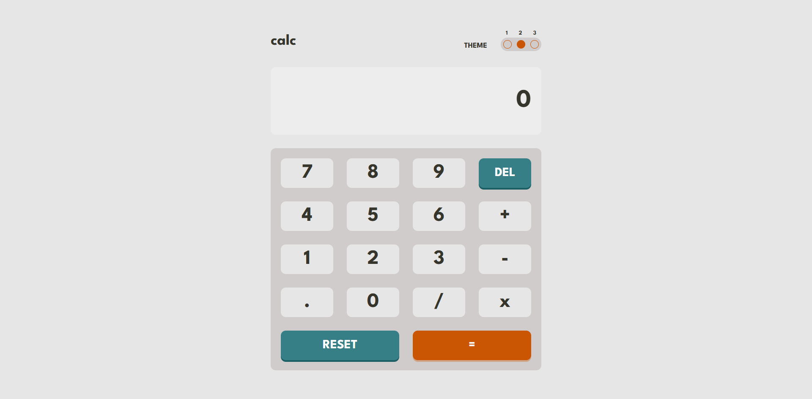
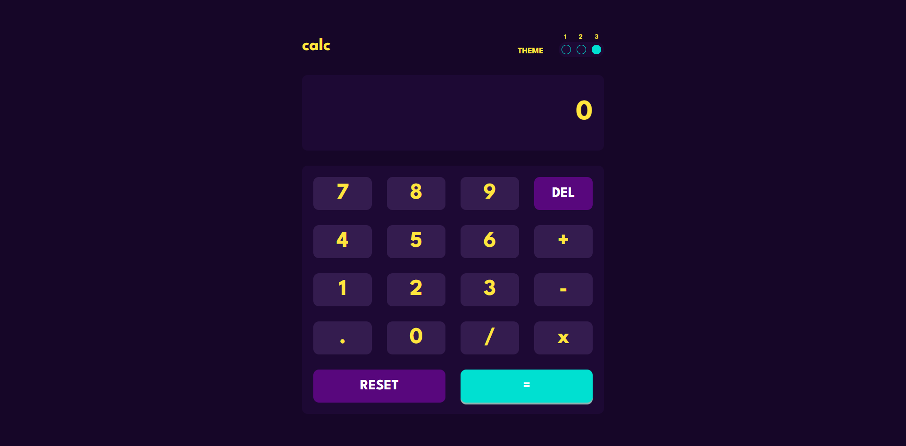

# Frontend Mentor - Calculator app solution

This is a solution to the [Calculator app challenge on Frontend Mentor](https://www.frontendmentor.io/challenges/calculator-app-9lteq5N29). Frontend Mentor challenges help you improve your coding skills by building realistic projects. 

## Table of contents

- [Overview](#overview)
  - [The challenge](#the-challenge)
  - [Screenshot](#screenshot)
  - [Links](#links)
- [My process](#my-process)
  - [Built with](#built-with)
  - [What I learned](#what-i-learned)
  - [Useful resources](#useful-resources)
- [Author](#author)

## Overview

### The challenge

Users should be able to:

- See the size of the elements adjust based on their device's screen size
- Perform mathmatical operations like addition, subtraction, multiplication, and division
- Adjust the color theme based on their preference
- **Bonus**: Have their initial theme preference checked using `prefers-color-scheme` and have any additional changes saved in the browser

### Screenshot

- Theme-1

- Theme-2

- Theme-3

### Links

- Solution URL: [GitHub](https://github.com/nefariooo/simple-calculator.git)
- Live Site URL: [Netify]()

## My process

### Built with

- Semantic HTML5 markup
- CSS custom properties
- Flexbox
- CSS Grid
- Mobile-first workflow
- Javascript for interaction and logic.

### What I learned

Dynamic changing of themes.

### Useful resources

- [Stack Overflow](https://stackoverflow.com/questions) - Best place to find the answer to every question even the  most basics one too.
- [W3 School](https://www.w3schools.com/css/default.asp) - Great website for CSS material and JS.
- [MDN Mozilla Developers](https://developer.mozilla.org/en-US/docs/Web/JavaScript) - Excellent and in-depth detail about frontend.

## Author

- Frontend Mentor - [@magnificent_thrush](https://www.frontendmentor.io/profile/magnificentthrush)

